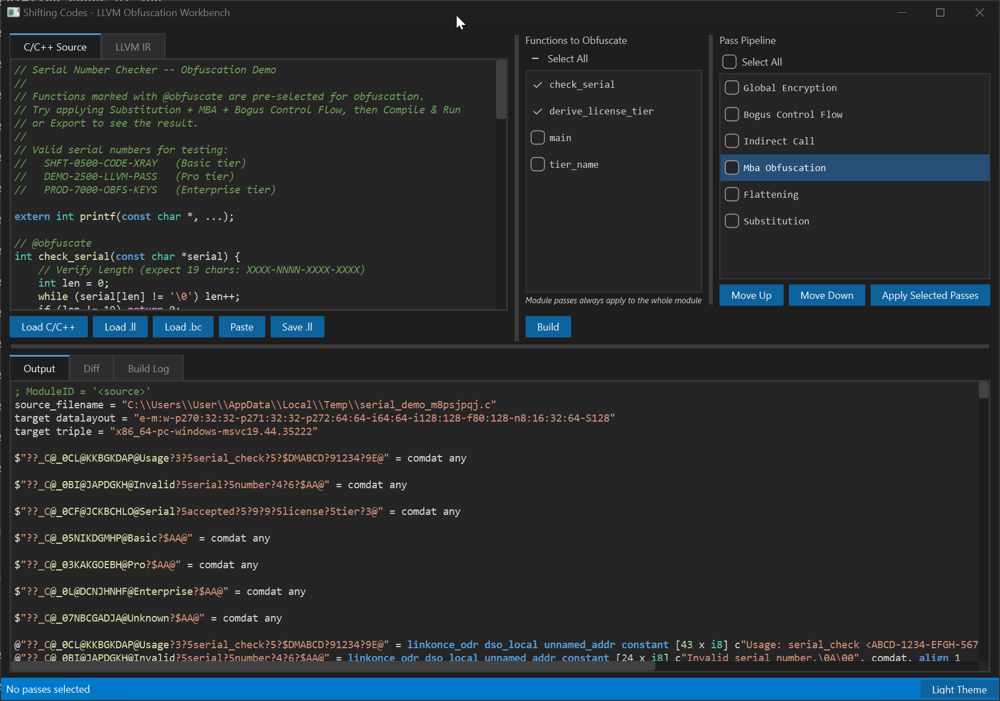

# Shifting Codes

Python port of [Pluto](https://github.com/bluesadi/Pluto) LLVM obfuscation passes using [llvm-nanobind](https://github.com/LLVMParty/llvm-nanobind) bindings (fork: [transformation-api](https://github.com/expend20/llvm-nanobind/tree/transformation-api)), with a PyQt6 visualization UI.



## Passes

Six obfuscation passes are available:

| Pass | Type | Description |
|------|------|-------------|
| **Substitution** | Function | Replaces arithmetic operations with equivalent but obscure sequences |
| **MBA Obfuscation** | Function | Applies Mixed Boolean-Arithmetic transformations using Z3-generated coefficients |
| **Bogus Control Flow** | Function | Inserts opaque predicates and dead code paths |
| **Flattening** | Function | Transforms control flow into a switch-based dispatch loop |
| **Global Encryption** | Module | XOR-encrypts global variable initializers with runtime decryption stubs |
| **Indirect Call** | Module | Replaces direct function calls with indirect calls through function pointers |

## Prerequisites

- **Python 3.12+**
- **[UV](https://docs.astral.sh/uv/)** package manager
- **llvm-nanobind** — must be cloned and built separately (see below)

## Installation

1. **Install UV** (if not already installed):

   ```bash
   pip install uv
   ```

2. **Clone and build llvm-nanobind** as a sibling directory:

   ```bash
   git clone -b transformation-api https://github.com/expend20/llvm-nanobind ../llvm-nanobind
   cd ../llvm-nanobind
   # Follow llvm-nanobind's build instructions to produce the build/ directory
   cd -
   ```

   The project expects the built package at `../llvm-nanobind/build/`.

3. **Install the project**:

   ```bash
   uv sync
   ```

## Usage

```python
import llvm
from shifting_codes.passes import PassPipeline
from shifting_codes.passes.substitution import SubstitutionPass
from shifting_codes.passes.mba_obfuscation import MBAObfuscationPass
from shifting_codes.passes.bogus_control_flow import BogusControlFlowPass
from shifting_codes.passes.flattening import FlatteningPass
from shifting_codes.passes.global_encryption import GlobalEncryptionPass
from shifting_codes.passes.indirect_call import IndirectCallPass
from shifting_codes.utils.crypto import CryptoRandom

rng = CryptoRandom(seed=42)

pipeline = PassPipeline()
pipeline.add(SubstitutionPass(rng=rng))
pipeline.add(MBAObfuscationPass(rng=rng))
pipeline.add(BogusControlFlowPass(rng=rng))
pipeline.add(FlatteningPass(rng=rng))
pipeline.add(GlobalEncryptionPass(rng=rng))
pipeline.add(IndirectCallPass(rng=rng))

# Apply to a module
pipeline.run(mod, ctx)
```

Passes are registered via `@PassRegistry.register` and can be looked up by name:

```python
from shifting_codes.passes import PassRegistry

cls = PassRegistry.get("substitution")
all_passes = PassRegistry.all_passes()
```

## Running Tests

```bash
# All tests
python -m uv run pytest tests/ -v

# Single test file
python -m uv run pytest tests/test_substitution.py -v

# Single test by name
python -m uv run pytest tests/test_substitution.py -k "test_add_substitution" -v
```

## UI

Launch the PyQt6 visualization GUI:

```bash
python -m uv run python -m shifting_codes.ui.app
```

## Project Structure

```
src/shifting_codes/
  passes/          # Obfuscation passes (base classes, registry, pipeline)
  utils/           # Shared utilities (crypto RNG, MBA solver, IR helpers)
  xtea/            # XTEA cipher — pure Python reference + LLVM IR builder
  ui/              # PyQt6 GUI for visualizing pass transformations
tests/             # pytest test suite
```
